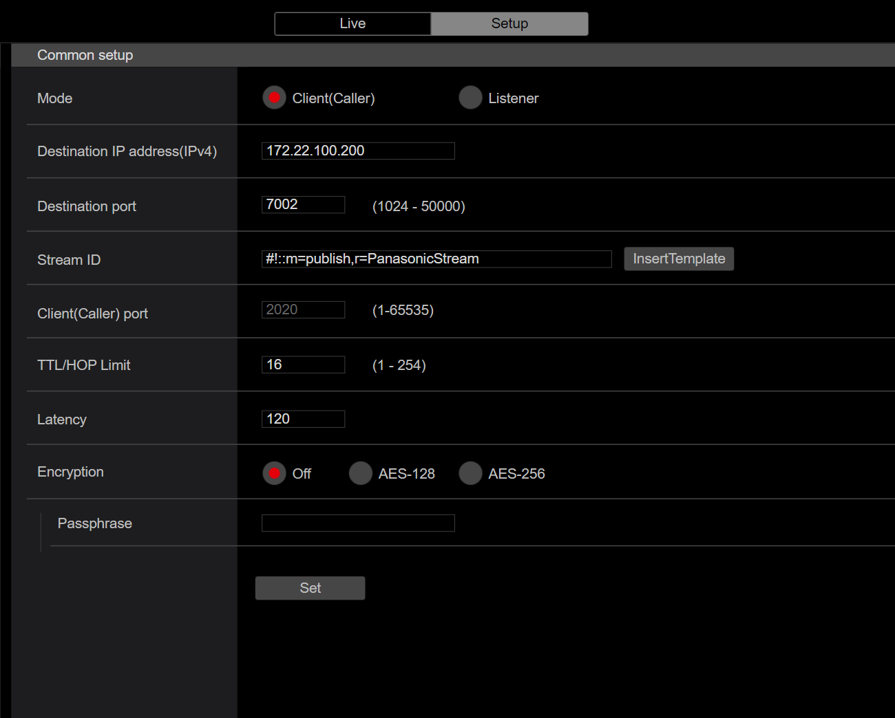
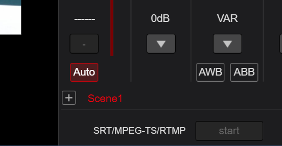

# Set up SRT streaming

We only have Secure Reliable Transport (SRT) streaming working for the cameras at the moment, while the cameras also work with MPEG-TS and RTMP. Theoretically, SRT offers lower latency (< 1s) compared to the other two, but experiments are needed to test whether this is true.

Also, utilizing ARQ (Automatic Repear reQuest), SRT detects lost packets and requests retransmission, ensuring reliable delivery even on unstable networks, making it suitable for data collection as well.

The main components of SRT streaming include:

- Caller: The device initiating the connection (e.g., an encoder)
- Listener: The device accepting the connection (e.g., a decoder or media server)

In our case, caller is the camera, and the listener is the SIE DGX or our laptops.



Shown in the image above it the config page on the camera. As mentioned, the camera is the caller. Set the destination IP and port to the device that receives the stream. 

Latency can also be configured here, with lower latency, we have faster stream but higher chance o packet loss. With higher latency, we get better quality but increased delay. Basically latency determines how long the listener waits for the incoming stream before playing things back live.

## Starting the Stream

On the listener, this saves the stream to an MKV file:

```bash
ffmpeg -i 'srt://172.22.100.200:7002?mode=listener' -c copy output1.mkv
```

On the caller, after setting things up, click start:



Click on the button again to stop streaming.

## Using the stream with GStreamer

```rust
// Create GStreamer pipeline
let pipeline = gstreamer::parse::launch(
        "srtsrc uri=srt://127.0.0.1:7002?mode=listener latency=120 ! \
     	tsdemux ! h264parse ! avdec_h264 ! videoconvert ! \
     	videoscale ! video/x-raw,width=640,height=640 ! appsink name=mysink"
    )
    .expect("Failed to create pipeline");
```

Above is an example how you can use GStreamer's appsink to gain efficient access to decoded video stream.

- `tsdemux` separates video and audio
- `h264parse` ensures correct framing and extracts metadata
- `avdec_h264` decodes H.264 stream
- `videoconvert` for compatibility
- `videoscale` for resizing
- `appsink` sends video frames to an application instead of displaying them

How does `appsink` work?

1. GStreamer pipeline pushes decoded video frames into `appsink`
2. `appsink` buffers incoming data and stores it in an internal queue
3. The application pulls frames using `pull_sample()`, which dequeues a frame
4. The sample contains a buffer (video), caps structure, and timing info
5. We then only get the buffer, and use `map_readable` to safely access the buffer